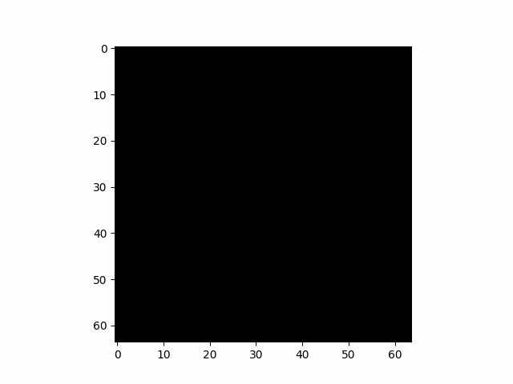
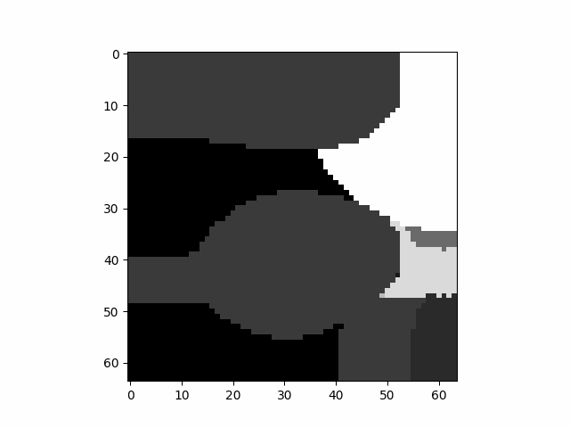

# NumPyRandomShapes3D
Generate 3D NumPy array with random shapes

### Example
**Random 3D Spheroid**  
  
**Random 3D Shapes** ((64, 64, 64) array, 32 shapes with (32, 32, 32) max size)  
  
**Random 3D Image** ((128, 128, 128) array, 64 shapes with (64, 64, 64) max size)  
  

# Special requirements
In addition to the usual dependencies (Numpy, OpenCV, SciPy), we use the following libraries :
* [NumPyDraw](https://github.com/Cyril-Meyer/NumPyDraw)  
Draw 2D and 3D shapes into NumPy array. (submodule)
* [perlin-numpy](https://github.com/pvigier/perlin-numpy)  
A fast and simple perlin noise generator using numpy. (pip install)
